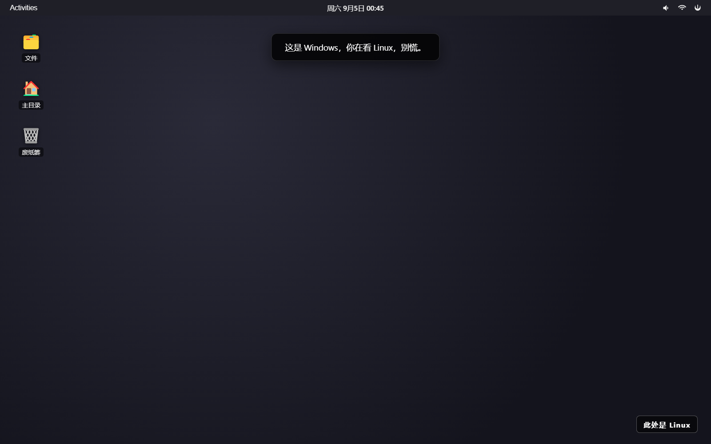
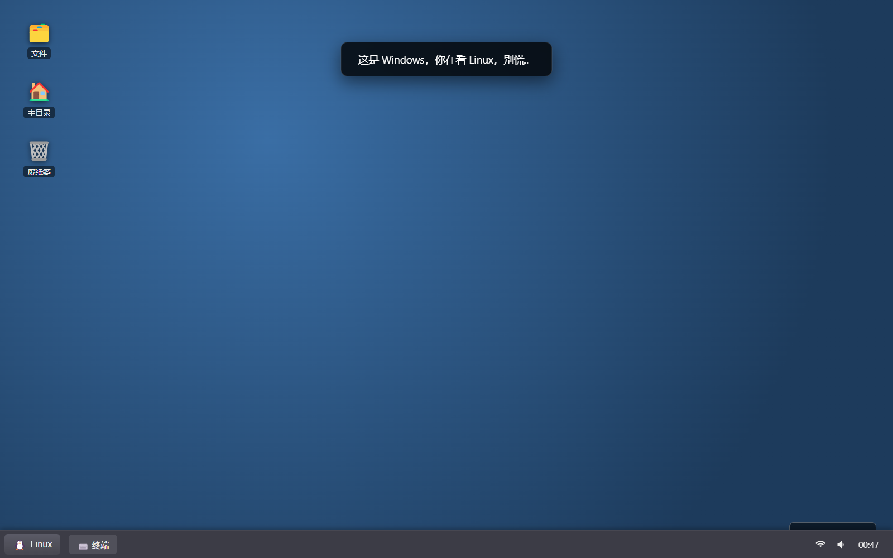

# winux 🐧💻

> **在 Windows 里跑到一个 Linux 桌面。没有 WSL，没有虚拟机，就是一个普通的 Windows 进程在硬装。**
>
> 你看着是 Windows，你在看 Linux，别慌。

## 这是什么

`winux` 是一个原生 Windows 应用程序（用 Electron 写的），打开就是一个"看起来完全像真的 Linux 桌面"的界面。

- 默认皮肤：**GNOME**（顶栏 + Activities 总览 + 应用网格 + 深色壁纸）
- 一键切换：**XFCE**（底部面板 + 应用菜单 + 蓝色壁纸）
- 桌面角落明晃晃挂着 **"此处是 Linux"**

**它真的就是一个 Windows 进程。** 没有 WSL，没有虚拟机，没有 Linux 内核，什么都没有。只是一个 Electron 窗口在努力假装自己是 GNOME Shell。

## 为什么做这个

因为"在 Windows 里跑 Linux 桌面"这件事本身就是一个自相矛盾的冷笑话。而大多数人第一反应是"这得用 WSL 或者虚拟机吧？"——答案是不用。这就是整活。

## 功能

- 🖥️ **GNOME 风格桌面**：顶部栏（Activities / 时钟 / 状态图标）、桌面图标、暗色 Adwaita 主题
- 🔍 **Activities 总览**：点左上角 Activities，桌面缩放模糊，出现搜索框 + 应用网格（文件、终端、Firefox、Nautilus、GIMP、VS Code…）
- 🪟 **应用窗口装饰**：GNOME 风格圆角窗口 + 标题栏 + 关闭按钮
- ⚡ **电源菜单**：锁定 / 注销 / 重启 / 关机（都是假的，什么都关不死，反而会弹一个"这是 Windows，别慌"）
- 🐧 **XFCE 皮肤**：一键切换，底部面板 / 应用菜单 / 时钟
- 💬 **开屏提示**：初次启动浮出"这是 Windows，你在看 Linux，别慌。"

## 截图

| GNOME | XFCE |
| --- | --- |
|  |  |

点击左侧 GNOME，看看它是怎么假装自己是 Linux 的；切到 XFCE（顶栏右侧 ⌘ 按钮或电源菜单），它就是另一个 Linux 了。

## 安装与运行

你需要 [Node.js](https://nodejs.org) 18+。

```bash
# 克隆
git clone https://github.com/Seanding1998/winux.git
cd winux

# 安装依赖
npm install

# 开发模式运行
npm start

# 打包成 exe
npm run dist
```

打包后在 `release/` 目录下得到 `winux Setup.exe`（安装包）和 `winux.exe`（便携版）。双击就能看到你的假 Linux 桌面。

## 截图说明

仓库 `docs/` 目录下放了实际生成的验收截图（`gnome.png`、`xfce.png`、`overview.png` 等）。上面表格里的图片就是它们。

## 技术细节

- Electron + TypeScript
- 渲染层是纯 HTML/CSS/JS，用`data-theme` 属性切换 GNOME / XFCE 皮肤
- 配置持久化走 `localStorage`
- 主进程与渲染进程通过 `contextBridge` 隔离（`contextIsolation: true`）

## 免责声明

我向你保证，这台机器上的任务栏真的是 Windows 的。它只是在**假装**自己是 Linux——而且假装得还挺像。

## License

MIT
